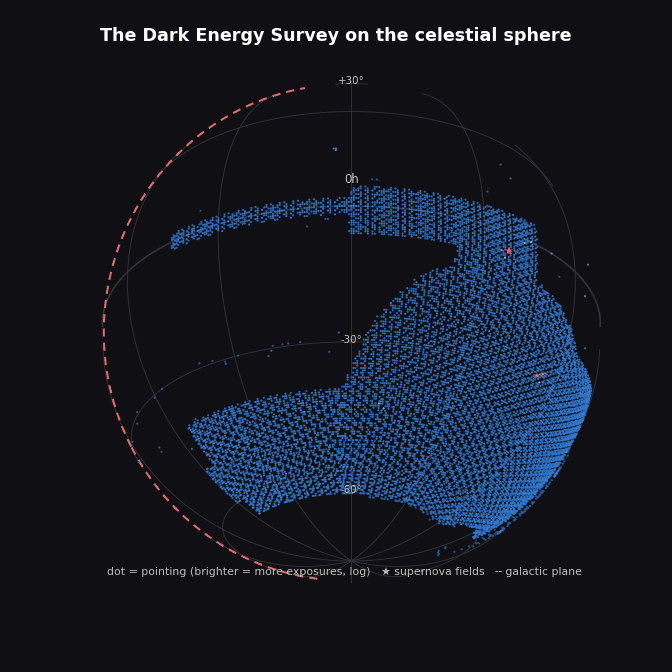
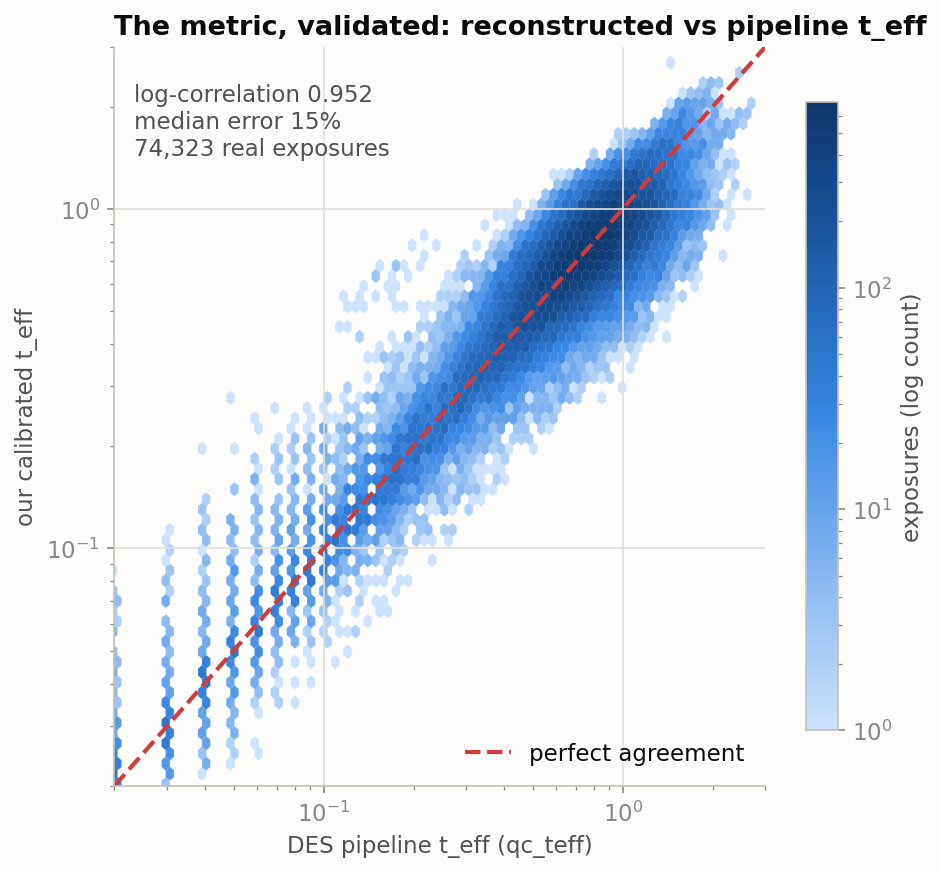
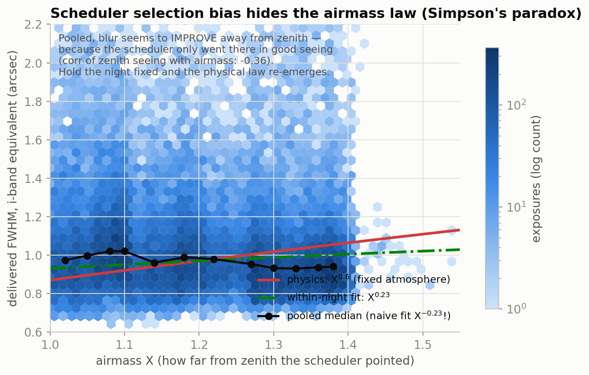
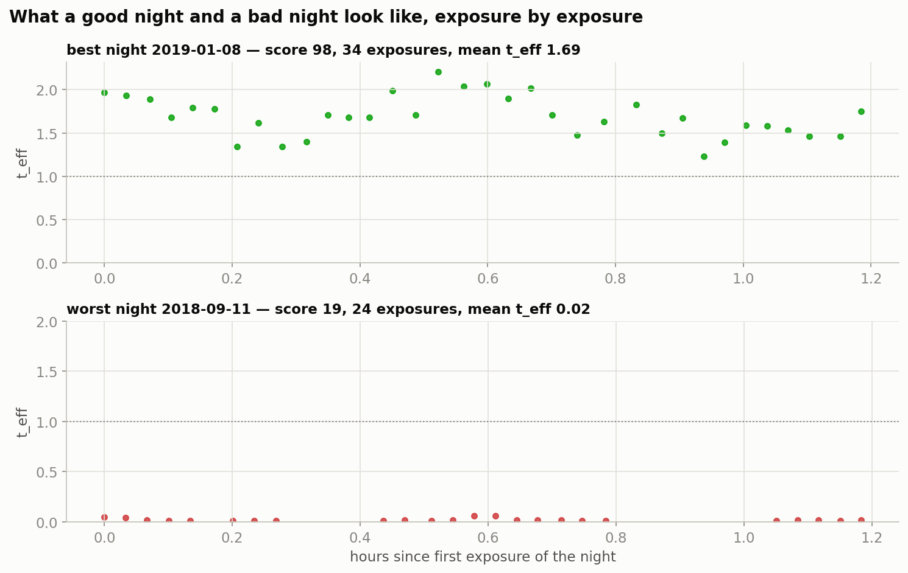

# skai-metrics

**Evaluation metrics and rewards for AI-based telescope schedulers**, built and validated on
105,890 real Dark Energy Survey (DES) exposures.

Summer 2026 research at the [SkAI Institute](https://skai-institute.org).
Live dashboard: **https://shaincarrasco.github.io/skai-metrics/**



## The question

An AI telescope scheduler picks what to point at next. To train or judge one, you need a number
that says how good a night of observing was. Clock time is not enough: an exposure taken through
bad seeing, clouds or a bright sky is worth less science than the same 90 seconds on a perfect
night.

## The metric

The *effective exposure time* discounts each exposure by the conditions it was taken in:

```
t_eff = η² · (FWHM_fid / FWHM)² · (b_dark / b)
```

A schedule's yield is how much of the wall-clock night it turns into effective science seconds,
`Σ t_eff · τ / night_span`. The toolkit adds image-quality and sky-coverage sub-scores and
combines them into one composite score per night.

## Results

| Check | Result |
|---|---|
| Calibrated `t_eff` vs DES pipeline `qc_teff` (74,323 exposures) | log-correlation **0.952**, median error 15% (paper constants: 24%) |
| Fitted fiducial FWHM vs wavelength | follows the atmospheric λ^-0.2 law |
| Composite score on 615 real DES nights | ranking stable under reweighting (Spearman ≥ 0.98 for most weight sets) |



**Finding: Simpson's paradox in scheduler logs.** Pooled across the survey, seeing appears to
*improve* with airmass (exponent −0.23), which is physically backwards. The DES scheduler only
pointed low in the sky when the atmosphere was good. Fitting within each night recovers the
physical direction (+0.23). Any model trained on raw scheduler logs inherits this bias.





## Layout

```
skai_metrics/   the package: data loading, t_eff, blur model, nightly schedule metrics
tests/          validation against DES's own pipeline quality values
notebooks/      01 image quality · 02 blur metric · 03 schedule scoring · 04 efficiency · 06 gaps
scripts/        figure + dashboard data generation
site/           the dashboard (GitHub Pages)
paper/          LaTeX write-up and poster
data/           des-exposures.csv (DES exposure metadata)
```

## Run it

```bash
pip install numpy pandas matplotlib astropy
python3 tests/test_metrics.py        # validate the metric on real data
python3 scripts/make_figures.py      # regenerate figures + dashboard stats
```

```python
from skai_metrics import load_exposures, night_metrics, composite_score

df = load_exposures(survey_only=True)
nights = night_metrics(df)
nights["score"] = composite_score(nights)
```

## References

- Neilsen et al. 2019, *Dark Energy Survey observation strategy* (defines `t_eff`)
- Terranova et al. 2023, *Self-Driving Telescopes*, arXiv:2311.18094 (`t_eff` as an offline-RL reward)
